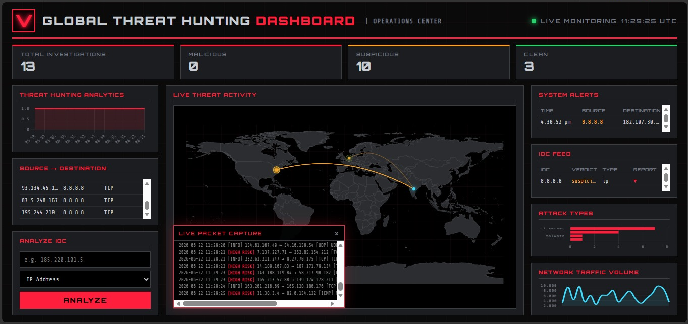

# Threat Hunting Dashboard

A SOC-style threat-hunting tool that takes an IOC (IP address, domain, or file hash), enriches it with **threat intelligence (VirusTotal)**, **geolocation (GeoIP)**, and **MITRE ATT&CK technique mapping**, then generates a downloadable **PDF incident report** — all from a single dark-themed dashboard.



  

## Features

- 🔍 **IOC Analysis** — submit an IP, domain, or file hash for triage
- 🛡️ **VirusTotal Integration** — reputation score, malicious vote count, threat category
- 🌍 **GeoIP Attacker Tracking** — live lookup with animated world-map markers
- 🧭 **MITRE ATT&CK Mapping** — auto-maps detected threat category to tactic + technique
- 📄 **Automated PDF Incident Reports** — one-click report generation per investigation
- 📊 **Live Stats** — malicious / suspicious / clean counts at a glance
- ⚡ **Demo Mode** — works fully offline with deterministic mock data if no API key is configured

## Tech Stack

`Python` · `Flask` · `MITRE ATT&CK` · `VirusTotal API` · `GeoIP (ip-api.com)` · `ReportLab (PDF)` · `Vanilla JS/SVG`

## Architecture

```
Threat-Hunting-Dashboard/
├── app.py                     # Flask routes & orchestration
├── modules/
│   ├── virustotal_api.py      # VT lookup (live + demo fallback)
│   ├── geoip_lookup.py        # IP -> location (live + demo fallback)
│   ├── mitre_attack.py        # threat category -> MITRE technique
│   └── pdf_report.py          # PDF incident report generator
├── templates/index.html       # Dashboard UI
├── static/css/style.css       # Dark neon SOC theme
├── static/js/dashboard.js     # Map rendering, API calls, table
├── sample_data/                # Persisted investigation history (JSON)
└── reports/                    # Generated PDF reports
```

## Setup

```bash
git clone https://github.com/vasanth-void-0x/Threat-Hunting-Dashboard.git
cd Threat-Hunting-Dashboard
pip install -r requirements.txt
cp .env.example .env
python app.py
```

Open `http://localhost:5000` in your browser.

### Live VirusTotal lookups (optional)

Get a free API key at [virustotal.com](https://www.virustotal.com/gui/join-us) and add it to `.env`:

```
VT_API_KEY=your_key_here
```

Without a key, the app runs in **demo mode** with deterministic mock data — same IOC always returns the same verdict, so it's safe to demo without an API key.

## How It Works

1. Analyst submits an IOC (IP/domain/hash) via the dashboard
2. `virustotal_api.py` checks reputation — malicious vote ratio decides verdict (clean / suspicious / malicious)
3. `geoip_lookup.py` resolves the attacker's approximate location (for IPs)
4. `mitre_attack.py` maps the detected threat category to a MITRE ATT&CK tactic + technique ID
5. Result is persisted and rendered on the live map + investigations table
6. Analyst can download a one-page PDF incident report for any investigation

## Sample IOCs to try (demo mode)

| IOC | Type |
|---|---|
| 185.220.101.5 | IP |
| 45.155.205.1 | IP |
| malware-test.com | Domain |

## Roadmap

- [ ] Authenticated multi-analyst mode
- [ ] Email alerting on malicious verdicts
- [ ] Bulk IOC upload via CSV
- [ ] Real-time feed ingestion from Wazuh/Splunk

## Author

**Vasanth Kumar** — Cybersecurity & Digital Forensics Graduate
[GitHub](https://github.com/vasanth-void-0x) · [LinkedIn](https://linkedin.com/in/vasanth-2k4)
